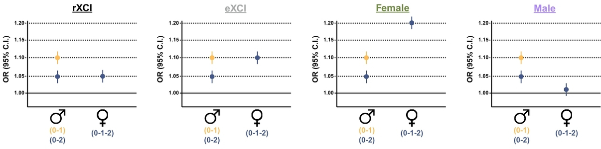

# geneXplore: An X-Chromosome-Wide Association Study (XWAS) Browser

## Overview

The X chromosome remains one of the most understudied regions of the human genome, despite comprising approximately 5% of the total genome and harboring over 800 protein-coding genes. This gap persists for several reasons: standard GWAS pipelines often exclude the X chromosome entirely, its unique biology including X-chromosome inactivation (XCI), hemizygosity in males, and pseudoautosomal regions. This demands specialized analytical approaches, while no harmonized resource exists for exploring X-chromosome association results across traits and ancestries.

This is a critical oversight, as the X chromosome is increasingly recognized as an important contributor to complex disease, particularly given well-established sex differences in the prevalence, severity, and progression of many conditions including neurodegenerative diseases, autoimmune disorders, and cardiovascular disease. Making X-chromosome association data accessible to the broader research community is therefore an important step toward understanding the genetic architecture of sex-differentiated traits.

**geneXplore** addresses this gap by providing a harmonized, publicly accessible XWAS browser built on the [PheWeb2](https://github.com/GaglianoTaliun-Lab/PheWeb2) & [PheWeb2-API](https://github.com/GaglianoTaliun-Lab/PheWeb2-API) framework, extended and tailored specifically for X-chromosome analysis. The browser hosts summary statistics from multiple XWAS studies across dichotomous traits, continuous traits, and brain single-cell trans-eQTLs, and allows users to explore and download association results interactively via Manhattan/Miami plots, PheWAS plots, and phenotype tables.

The browser is publicly available at: **[INSERT FENIX URL]**

<p align="center">
  
</p>

---

## X-Chromosome Specific Modifications

geneXplore extends PheWeb2 with the following X-chromosome-specific modifications:

### 1. X-Chromosome Inactivation (XCI) Modeling
To properly account for XCI, association results are stratified by four modeling approaches:
- **rXCI** — random X-chromosome inactivation (Females: 0/1/2; Males: 0/2)
- **eXCI** — escape from X-chromosome inactivation (Females: 0/1/2; Males: 0/1; double dosage)
- **Female** — female-only analysis
- **Male** — male-only analysis

<p align="center">
  
</p>

### 2. Single-Chromosome Binning Fix
The default PheWeb2 Manhattan plot binning algorithm was designed for genome-wide data and produces incorrect bin sizes when applied to a single chromosome. geneXplore corrects this by setting `BIN_LENGTH=3e4` in `pheweb_override/manhattan.py`.

### 3. Significance Threshold
geneXplore uses a suggestive significance threshold of **P < 1×10⁻⁵** for visualization, reflecting the reduced multiple testing burden of X-chromosome-only analyses compared to genome-wide studies. The backend peak-calling threshold is set to `MANHATTAN_PEAK_PVAL_THRESHOLD=1e-5` accordingly.

### 4. GRCh38 Liftover
All summary statistics are aligned to **GRCh38 (hg38)** prior to ingestion.

---

## Repository Structure

```
geneXplore_XWAS_Browser/
│
├── README.md
│
├── pheweb_override/
│   └── manhattan.py                         ← BIN_LENGTH=3e4 fix
│
├── example_codes/
│   ├── 01_xwas_modeling/
│   │   ├── rXCI_eXCI_genotype_modeling.R   ← PLINK raw genotype modeling
│   │   └── eXCI_meta_analysis.R            ← random effects meta-analysis
│   │                                           from male/female summary stats
│   ├── 02_liftover/
│   │   └── liftover_hg19_to_hg38.R          ← GRCh38 liftover
│   ├── 03_preprocessing/
│   │   └── summary_stat_preprocessing.R     ← formatting/QC before
│   │                                           pheweb2 ingestion
│   └── 04_browser_configuration/
│       ├── format_for_pheweb.py             ← formatting for pheweb2 ingestion
│       └── update_significance_threshold.py ← sync P<1e-5 across
│                                               frontend and backend
└── docs/
    ├── user_guide.md                        ← geneXplore user guide
    ├── pipeline_overview.png                ← full workflow schematic
    └── images/
        ├── geneXplore.jpg                   ← geneXplore logo
        ├── Xchr_modeling_fig.jpg            ← X-chromosome modeling overview
        ├── home_search_example.png          ← searching from home page
        ├── stratification_dropdown.png      ← stratification dropdown menu
        ├── miami_plot_example.png           ← Miami plot
        ├── phewas_plot_example.png          ← PheWAS plot
        ├── top_hits_example.png             ← stacked locus zoom plot
        ├── phenotypes_table_example.png     ← phenotypes table
        └── download_example.png             ← downloaded summary stat format
```

---


## Adding Your Data to geneXplore

We welcome the inclusion of additional XWAS summary statistics in the public geneXplore browser. If you have X-chromosome association results you would like to make publicly available through geneXplore, please contact us at **noahc@wustl.edu** or **belloy@wustl.edu**. 

---

## Citation

If you use geneXplore in your research, please cite:

- **[CITATION PLACEHOLDER — Bioinformatics Application Note, in preparation]**
- **Bellavance, J., Xiao, H., Chang, L., Kazemi, M., Wickramasinghe, S., Mayhew, A.J., Raina, P., VandeHaar, P., Taliun, D., & Gagliano Taliun, S.A. (2026). Exploring and visualizing stratified GWAS results with PheWeb2. Nature Genetics. https://doi.org/10.1038/s41588-025-02469-8**

---

## Contact

Developed by the [Belloy Lab](https://belloylab.wustl.edu/) at Washington University in St. Louis.

For questions or inquiries, please contact: **noahc@wustl.edu** or **belloy@wustl.edu**. 
