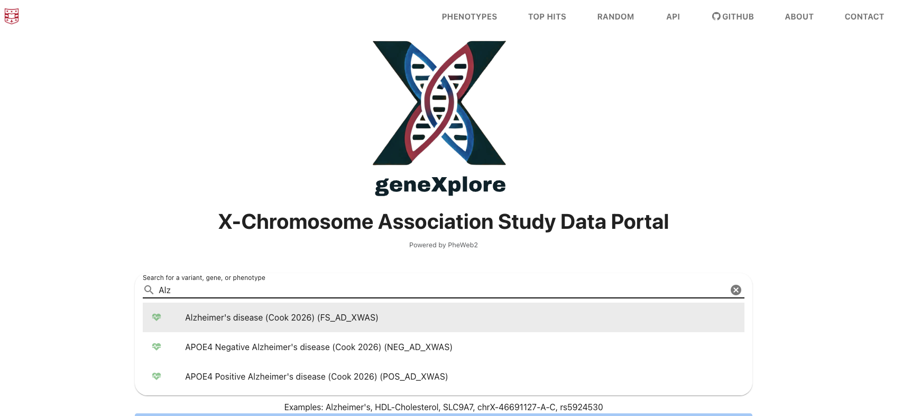

# geneXplore User Guide

## Overview

geneXplore is an interactive browser for exploring X-chromosome-wide association study (XWAS) results across multiple traits, ancestries, and X-chromosome inactivation modeling strategies. This guide covers how to navigate and use the browser effectively.

---

## 1. Searching

The search bar on the home page accepts:
- **Phenotype name** — e.g. `Alzheimer's disease`
- **Gene name** — e.g. `SLC9A7`
- **Variant** — e.g. `chrX-46691127-A-C | rs5924530`

---

## 2. Selecting Stratifications

All results in geneXplore are stratified by **ancestry** and **sex modeling approach**. Use the dropdown menus to select your stratum of interest.

### Ancestry
| Value | Description |
|-------|-------------|
| `european` | European ancestry |
| `african` | African ancestry |
| `hispanic` | Hispanic ancestry |
| `east-asian` | East Asian ancestry |
| `south-asian` | South Asian ancestry |
| `cross-ancestry` | Cross-ancestry (multi-ethnic) analysis |

### Sex Modeling Approach
| Value | Description |
|-------|-------------|
| `rXCI` | Random X-chromosome inactivation — random effects meta-analysis combining male and female summary statistics, assuming random XCI in females |
| `eXCI` | Escape from X-chromosome inactivation — models loci where females express both X chromosomes, rather than inactivating one |
| `female` | Female-only analysis |
| `male` | Male-only analysis |

> Not all stratifications are available for every phenotype — dropdowns will reflect only the strata present for the selected trait.

---

## 3. Manhattan / Miami Plot

The Manhattan plot displays association results across the X chromosome. The Miami plot displays two strata simultaneously (top and bottom panels) for direct visual comparison.

- The horizontal dashed line represents the suggestive significance threshold of **P < 1×10⁻⁵**, chosen to reflect the reduced multiple testing burden of X-chromosome-only analyses
- Hovering over a variant displays its chromosome position, alleles, and p-value
- Clicking a variant navigates to its variant page with full association details

---

## 4. PheWAS Plot

The PheWAS (Phenome-Wide Association Study) plot displays association results for a single variant across all phenotypes in the browser. This is useful for assessing the pleiotropic effects of a variant of interest across traits and disease categories.

---

## 5. Top Hits

The Top Hits tab allows users to visually explore genetic overlap (pleiotropy) across multiple phenotypes simultaneously within a focused genomic region.

Key features:
- **Multi-phenotype display** — stack multiple traits on the same zoomed-in genomic region to assess co-localization
- **Toggle traits** — show or hide individual phenotypes interactively
- **Adjust region** — zoom in or out to a genomic region of interest
- **Tagging variant** — select a lead variant to anchor the regional view
- **LD population** — choose the reference population used to calculate linkage disequilibrium (LD)
- **Download** — export the regional plot directly

---

## 6. Phenotypes Table

The phenotypes table lists all available traits in the browser. It can be:
- **Sorted** by any column (e.g. top p-value)
- **Filtered** by category, ancestry, or sex stratum

---

## 7. Downloading Summary Statistics

Summary statistics for any phenotype-stratum combination can be downloaded directly from the browser. Downloaded files are tab-delimited and contain the following columns:

| Column | Description |
|--------|-------------|
| `CHROM` | Chromosome (X) |
| `POS` | Base pair position (GRCh38/hg38) |
| `REF` | Reference allele |
| `ALT` | Alternative allele — this is the effect allele to which `BETA`, `SE`, and `P` refer |
| `AF` | Allele frequency of the `ALT` allele within the specific dataset for that stratum (e.g. female-only AF for female strata) |
| `BETA` | Effect size estimate (log odds ratio for dichotomous traits; regression coefficient for continuous traits) for the `ALT` allele |
| `SE` | Standard error of `BETA` |
| `P` | Association p-value |
| `TEST` | Statistical test used for the association — always `ADD` (additive model) |

---

## 8. Contact and Data Submission

If you would like to have your XWAS summary statistics included in geneXplore, please contact us at **noahc@wustl.edu** or **belloy@wustl.edu**. Summary statistics must be X-chromosome-only and aligned to GRCh38.
